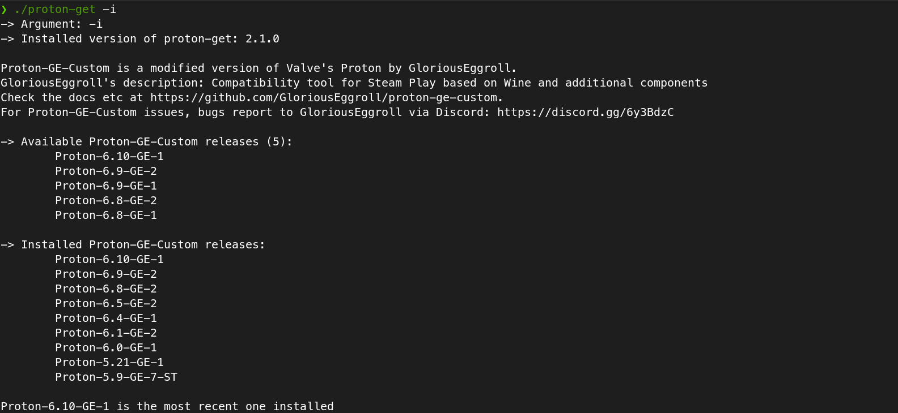

# Proton Get



Gets the latest version, compares with the installed one(s) of [Proton GE](https://github.com/GloriousEggroll/proton-ge-custom), downloads it and extracts to $HOME/.local/share/Steam/compatibilitytools.d/. It uses __wget__ and requires __xidel__ [Xidel](https://github.com/benibela/xidel/) to avoid messy, unpredictable regex inside a Bash script. To be less invasive it won't install Xidel. It is by default downloaded to a temporary folder to be used from there. Passing "1" as an argument for __setup.sh__, will install __xidel__ in $HOME/.local/bin.

- https://github.com/GloriousEggroll/proton-ge-custom
- https://github.com/benibela/xidel/


## Install
To install it. Clone, get into its folder and run ./setup.sh..
1. To do it open a terminal.
1. Make sure you are inside a folder that you want to store the contents of the repository. You can check where you are with the __pwd__ utility;
```
❯ pwd
```
1. That done, you must check if your systenm have __git__ installed. If notify install via your package manager. Some of them are: apt (Debian, Mint, POP!_OS, Ubuntu and some others), dnf (Fedora, current CentOS), pacman (Archlinux, Manjaro, Archlinux GUI and others), zypper (OpenSUSE, SUSE). Unfortunetely your shell won't (probably) informe you which one is if you type the wrong one, but at least will tell you that the command was not found, so just check on your distro:
```
❯ sudo apt install git
# or
❯ sudo dnf install git
# or
❯ sudo pacman -S git
# or
❯ sudo zypper in git
```
```
❯ git clone https://gitlab.com/msmafra/proton-get
❯ cd proton-get
❯ ./setup.sh
```

### Install with Xidel
If you wish to install xidel too, not just use it from the temporary directory, add "1" as a parameter for setup.sh

```
❯ git clone https://gitlab.com/msmafra/proton-get
❯ cd proton-get
❯ ./setup.sh 1
```

As setup.sh will install the proton-get into *$HOME/.local/bin* and make it executable. If it is in your user's **$PATH** variable, it will be executed from any place.

### The PATH variable
The executables will be placed in *$HOME/.local/bin*, so after the **setup.sh** install them, the reopening of the terminal window will enable them.

## Usage
To check and install the newest version or Proton-GE-Custom use -i or --install:
```
❯ proton-get -i
```
To check for a new version of proton-get use -c --check:

```
❯ proton-get -c
```

### Parameters for proton-get
```
-c or --check will just check for a new version of Proton-GE-Custom
-i or --install will download and extract Proton-GE-Custom
-n or --dryrun  will run proton-get without downloading and installing anything
-u or --update will check and install the latest version of proton-get
-v or --version will show the current proton-get version
-t or --time <hour>		will create a schedule to run proton-get --check
                Running proton-get --time 20 will schedule it to run every day at 20:00
                <hour> can be a value from 0 to 23
```
## Easy installed
This one line runs 3 things: cd to change to the /tmp directory; curl to download only the proton-get script and at the as soon as it has finished downloading
```
protonget_dest="${HOME}/.local/bin" && cd /tmp && curl --silent https://gitlab.com/msmafra/proton-get/-/raw/master/proton-get > "${protonget_dest}"/proton-get && wget --continue https://gitlab.com/msmafra/proton-get/-/raw/master/xidel --output-document="${protonget_dest}"/xidel && chmod +x "${protonget_dest}"/xidel
```

## Update problems? Run this:
```
pgpath="$HOME/.local/bin" && \
mkdir -pv "${pgpath}" && cd /tmp && \
curl -L https://gitlab.com/msmafra/proton-get/-/raw/master/proton-get > "${pgpath}/proton-get" && \
chmod +x "${pgpath}/proton-get"

```

It will replace the contents of your current proton-get disrregarding its version.
You can also install it this way, but you need Xidel in your system's $PATH to use it.
