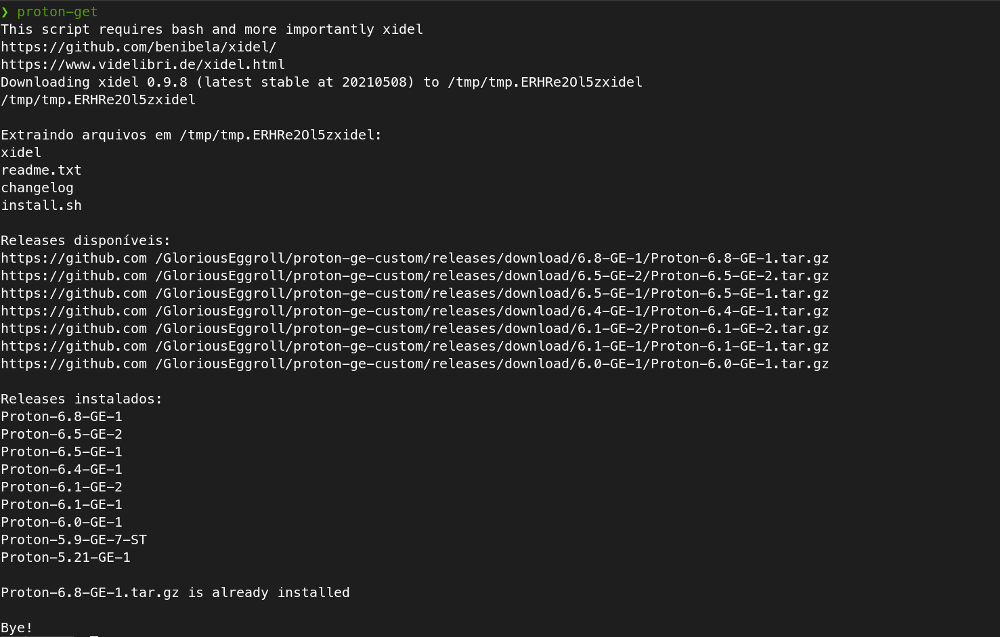

# Proton Get



Gets the latest version, compares with the installed one(s) of Proton GE (https://github.com/GloriousEggroll/proton-ge-custom), downloads it and extracts to $HOME/.local/share/Steam/compatibilitytools.d/.

Uses Xidel.

https://github.com/benibela/xidel/

## Install
To install it to your $HOME/.local/bin

```
./setup.sh
```

## Usage
```
proton-ge
```
