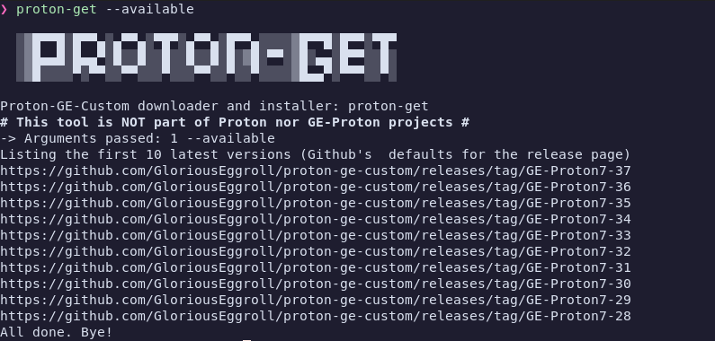

# Proton Get



Gets the latest version, compares with the installed one(s) of [Proton GE](https://github.com/GloriousEggroll/proton-ge-custom), downloads it and extracts to $HOME/.local/share/Steam/compatibilitytools.d/. It requires __wget__ and __xidel__. [Xidel](https://github.com/benibela/xidel/) is to avoid messy, unpredictable regex inside a Bash script. To be less invasive it won't install Xidel. It is by default downloaded to a temporary folder to be used from there. Passing "1" as an argument for __setup.sh__, will install __xidel__ in $HOME/.local/bin.

- https://github.com/GloriousEggroll/proton-ge-custom
- https://github.com/benibela/xidel/


## Install
To install it. Clone, get into its folder and run ./setup.sh.:

```
❯ git clone https://gitlab.com/msmafra/proton-get
❯ cd proton-get
❯ ./setup.sh
```
### Also install Xidel
If you wish to install xidel too, not just use it from the temporary directory, add "1" as a parameter for setup.sh

```
❯ git clone https://gitlab.com/msmafra/proton-get
❯ cd proton-get
❯ ./setup.sh 1
```

## Usage
As setup.sh will install the proton-get into *$HOME/.local/bin* and make it executable. If it is in your user's **$PATH** variable, it will be executed from any place.
```
❯ proton-get
```
### PATH

The executables will be placed in *$HOME/.local/bin*, so after the **setup.sh** install them, the reopening of the terminal window will enable them.

## Parameters for proton-get
-n or --dryrun  will run proton-get without downloading and installing anything
```
proton-get -n
proton-get --dryrun
```
-u or --update will check and install the lastest version of proton-get
```
 proton-get -u
 proton-get --update
 ```
-v or --version will show the current proton-get version
```
proton-get -v
proton-get --version
```
